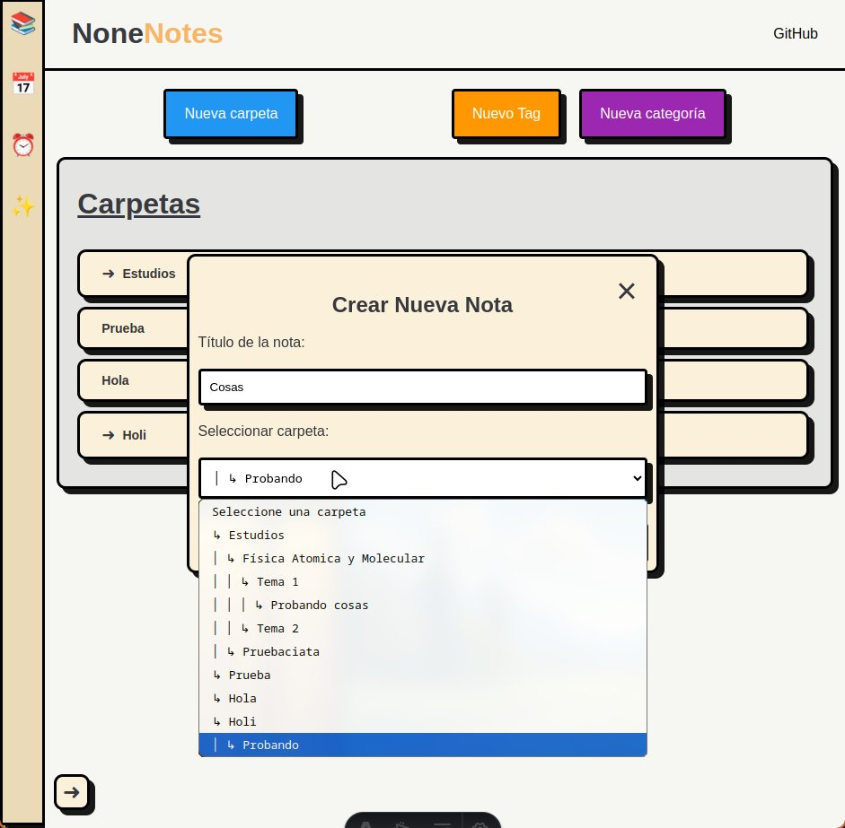

# NoneNote

**NoneNote** es un proyecto personal en desarrollo cuyo objetivo es crear una plataforma autohosteada, flexible y minimalista para la organización personal. La idea principal es desarrollar una aplicación que permita gestionar de forma eficiente notas, calendarios y recordatorios, con posibilidad de incorporar más funcionalidades en el futuro.

## Tecnologías Utilizadas

### Frontend

- **Astro:**
  - Framework principal.
- **React:**
  - Interfaz de usuario interactiva y moderna.
  - Manejo del estado con React Hooks.

### Backend

- **Django:**
  - Framework principal del servidor.
- **Django Rest Framework:**
  - Creación de APIs REST para conectar el frontend y el backend.
- **JWT (JSON Web Tokens):**
  - Sistema de autenticación seguro para los usuarios.

### Base de Datos

- **SQLite:**
  - Base de datos inicial para desarrollo.
- **PostgreSQL:**
  - Previsto para despliegues en producción.

## Futuro del Proyecto

La idea es completar el desarrollo de las funcionalidades pendientes, incluyendo:

- **Gestión de Notas:** Mejoras en la organización y visualización.
- **Calendarios:** Sincronización con recordatorios y eventos.
- **Recordatorios:** Integración completa con notificaciones personalizadas.

Una vez completado el desarrollo principal, el siguiente paso será dockerizar el proyecto para facilitar su despliegue y escalabilidad en diferentes entornos.

## Resultado preliminar:

### Pantalla de inicio:

### Pantalla de notas:

## TODO

### Calendario

- [x] Parte visual
- [ ] Creación de evento

### Notas

- [x] Parte visual
- [x] Creación de notas
- [x] Creación de carpetas
- [x] Creación de tags
- [x] Creación de categorías
- [x] Implementación de filtros
- [x] Poder modificar el contenido de las notas
- [ ] Poder mover las notas
- [ ] Poder mover los folders

### Recordatorio

- [ ] Parte visual
- [ ] Backend

## Inspiración de Template

[https://gitingest.com/](https://gitingest.com/)
